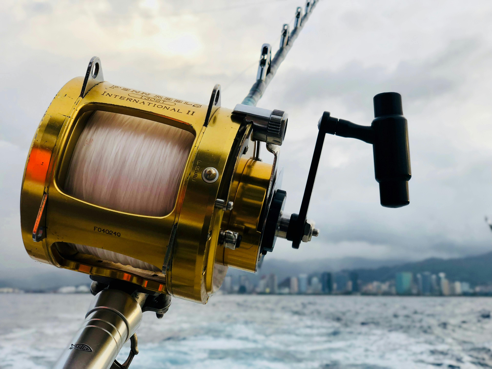

# 🎣 Mr Hook - Premium Fishing Supplies

A beautiful, modern e-commerce website for fishing supplies built with vanilla JavaScript and CSS. Features a stunning responsive design with smooth animations, comprehensive product management, user authentication, and shopping cart functionality.



## ✨ Features

### 🎨 Beautiful Design
- **Modern UI/UX** with custom CSS variables and design system
- **Smooth animations** and micro-interactions throughout
- **Responsive design** optimized for mobile, tablet, and desktop
- **Brand colors**: Dark Blue (#324380) and Orange (#FF5A08)
- **Professional typography** with Inter font family

### 🛍️ E-commerce Functionality
- **Product catalog** with 8 premium fishing products
- **Advanced filtering** by name, category, and price range
- **Product detail modals** with quantity selection
- **Shopping cart** with persistent storage
- **User authentication** (login/signup)
- **Order management** and history
- **Responsive checkout** process

### 📱 Mobile-First Design
- **Collapsible mobile menu** with smooth animations
- **Touch-friendly interface** with proper sizing
- **Mobile-optimized filters** and product grid
- **Swipe-friendly** product cards
- **Accessible** design with proper focus states

### 🎭 Advanced Animations
- **Loading screen** with spinning animation
- **Staggered product cards** entry animations
- **Parallax hero section** with overlay effects
- **Smooth page transitions** between sections
- **Button ripple effects** and hover states
- **Toast notifications** with slide animations

## 🚀 Getting Started

### 🔥 Quick Deploy to Replit (Recommended)

1. **Import to Replit**
   - Go to [Replit.com](https://replit.com)
   - Click "Create Repl" → "Import from GitHub"
   - Paste this repository URL or upload the project files
   - Replit will automatically detect the project type

2. **Run the Project**
   - Click the "Run" button in Replit
   - Your site will be live immediately with a public URL
   - No additional setup required!

### 🖥️ Local Development

#### Prerequisites
- Node.js 14+ (for live-server)
- Modern web browser

#### Installation

1. **Install dependencies**
   ```bash
   npm install
   ```

2. **Start development server**
   ```bash
   npm run dev
   ```

3. **Open in browser**
   - The site will automatically open at `http://localhost:3000`

#### Alternative (Without Node.js)
Simply open `index.html` in your web browser for basic functionality.

### 🌐 Replit Deployment Benefits
- ✅ **Instant hosting** with public URL
- ✅ **Zero configuration** required
- ✅ **Automatic SSL** certificate
- ✅ **Built-in code editor** for easy modifications
- ✅ **Version control** and collaboration features
- ✅ **Mobile responsive** testing tools

## 📁 Project Structure

```
MrHook/
├── index.html              # Main HTML file
├── css/
│   ├── styles.css          # Main styles and variables
│   ├── components.css      # Component-specific styles
│   └── animations.css      # Animations and transitions
├── js/
│   ├── data.js            # Product and mock data
│   ├── utils.js           # Utility functions
│   ├── components.js      # Component logic
│   └── app.js             # Main application logic
├── assets/                # Product images
└── README.md
```

## 🎯 User Journey

### For Visitors
1. **Browse products** on the beautiful hero section
2. **Filter products** by category, name, or price
3. **View product details** in elegant modals
4. **Create account** with simple signup form

### For Logged-in Users
1. **Add products to basket** with quantity selection
2. **Manage basket** with quantity updates and removals
3. **Complete orders** with one-click checkout
4. **View order history** in profile section
5. **Update profile** information

## 🛠️ Technical Features

### CSS Architecture
- **CSS Custom Properties** for consistent theming
- **Mobile-first** responsive design approach
- **CSS Grid & Flexbox** for modern layouts
- **Advanced animations** with keyframes
- **Component-based** styling approach

### JavaScript Features
- **ES6+ modern syntax** throughout
- **Modular architecture** with separate components
- **Local storage** for cart and user persistence
- **Event delegation** for performance
- **Debounced search** for smooth filtering
- **Error handling** with user-friendly messages

### Performance Optimizations
- **Lazy loading** for product images
- **Throttled scroll** events
- **Debounced search** input
- **Efficient DOM** manipulation
- **Minimal dependencies** (vanilla JS)

## 🎨 Design System

### Colors
```css
--primary-color: #324380     /* Dark Blue */
--secondary-color: #FF5A08   /* Orange */
--gray-50: #f9fafb          /* Light backgrounds */
--gray-900: #111827         /* Dark text */
```

### Typography
- **Font Family**: Inter (Google Fonts)
- **Font Sizes**: Responsive scale from 0.75rem to 3rem
- **Font Weights**: 300, 400, 500, 600, 700

### Spacing
- **Consistent spacing** using CSS custom properties
- **8px base unit** for predictable layouts
- **Responsive spacing** that scales with screen size

## 📊 Product Categories

1. **Fishing Rods** - Premium carbon fiber and spinning reels
2. **Hooks** - Professional hook sets in various sizes
3. **Bait** - Fresh live bait collections
4. **Containers** - Tackle boxes and bait buckets
5. **Other** - Fishing line, multi-tools, and accessories

## 🔐 Demo Credentials

For testing the authentication system:

**Email**: `john.smith@email.com`  
**Password**: `password123`

Or create a new account with the signup form.

## 🎭 Animation Showcase

### Loading Animations
- Spinning loading screen with brand colors
- Fade-out transition to main content

### Product Animations
- Staggered card entry with delays
- Hover effects with scale and shadow
- Image scaling on card hover

### Interactive Elements
- Button ripple effects on click
- Form input focus animations
- Toast notification slides
- Modal scale-in animations

### Scroll Effects
- Header hide/show on scroll
- Parallax hero background
- Scroll-triggered animations

## 🌟 Key Highlights

### User Experience
- **Intuitive navigation** with clear visual hierarchy
- **Instant feedback** through animations and toasts
- **Consistent interactions** across all components
- **Accessibility** features for screen readers

### Visual Design
- **Professional branding** with fishing theme
- **High-quality imagery** showcasing products
- **Consistent spacing** and typography
- **Beautiful color palette** with proper contrast

### Technical Excellence
- **Clean, maintainable code** with clear separation
- **Performance optimized** with efficient event handling
- **Error handling** with graceful degradation
- **Browser compatibility** across modern browsers

## 🔮 Future Enhancements

### Backend Integration
- Replace mock data with real API
- Add user authentication with JWT
- Implement payment processing
- Add product reviews and ratings

### Additional Features
- Wishlist functionality
- Product search with autocomplete
- Email notifications
- Social media integration
- Progressive Web App (PWA) features

## 📝 Notes

This is a frontend-only implementation using vanilla JavaScript and CSS. All data is stored locally in the browser and will reset on page refresh (except for cart and user data which uses localStorage).

The design prioritizes visual excellence, smooth animations, and responsive behavior to create a premium shopping experience for fishing enthusiasts.

---

**Created for Mr Hook Fishing Supplies** - Where every cast counts! 🎣